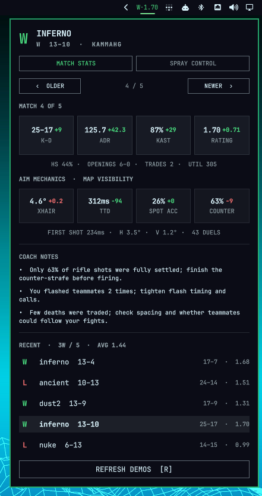
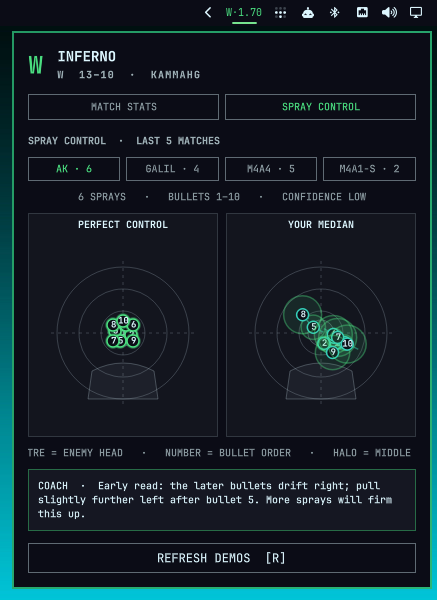

# omarCS

omarCS is a local-first Counter-Strike 2 match dashboard for the Omarchy
shell. Plugin id: `omarcs.stats`. License: MIT.

It imports CS2 `.dem` files, calculates personal Match Reports with the
native Rust backend, stores a small local history, and shows the latest
result and recent trends in the bar. All demos and derived data stay on
this computer.





## Install

```bash
omarchy plugin add https://github.com/Kieren-Foenander/omarCS.git --enable
```

`omarchy plugin add` only clones and validates the repository. It does
not run plugin code or install hooks. Enabling the widget is the
consent to finish setup.

On first open, the widget:

- creates an isolated Python environment under `~/.cache/omarcs/venv`
- builds `omarcs-native` when that binary is missing
- downloads SHA-256-pinned CS2 helper archives into `~/.local/share/omarcs/`
- writes the CS2 Game State Integration file and a user-level systemd
  unit, backing up any existing file it replaces
- starts `omarcs-autofetch.service` and scans the usual demo folders

`uv` and `cargo` are required. `uv` is commonly already installed; if the
widget reports that it is missing:

```bash
omarchy pkg add uv
```

No sudo or pkexec is required. Place the widget with:

```bash
omarchy bar move omarcs.stats --section right
```

## Remove

```bash
omarchy plugin update omarcs.stats
omarchy plugin remove omarcs.stats
```

Removing the plugin unloads the dashboard. To stop automatic match
fetching as well:

```bash
systemctl --user disable --now omarcs-autofetch.service
rm ~/.config/systemd/user/omarcs-autofetch.service
```

Optional leftovers, only if you want them gone too:

- `~/.config/omarcs/config.toml` — optional user settings; omarCS never
  creates this file
- `gamestate_integration_omarcs.cfg` in the local CS2 `cfg` directory
- `~/.local/state/omarcs/` — Match Report history
- `~/.local/share/omarcs/` — demos, helper tools, and the native binary
- `~/.cache/omarcs/` — Python environment

## What enabling writes

omarCS does not edit `~/.config/omarchy/shell.json`. Omarchy's own
`plugin enable` / `plugin remove` commands own bar placement.

When you enable the widget (or run `omarcs setup-auto`), omarCS may
replace these files after copying a timestamped backup into
`~/.local/state/omarcs/backups/`:

- `~/.config/systemd/user/omarcs-autofetch.service`
- `gamestate_integration_omarcs.cfg` in the local CS2 `cfg` directory

It never overwrites `~/.config/omarcs/config.toml`. Create that file
yourself if you want to pin a Steam account or change import paths.

## Usage

Click the bar pill to open the popup. Use **Older** / **Newer**, click a
recent-match row, or press Left/Right (`H`/`L`) to browse the five most
recent games. Press `R`, click **Refresh demos**, or middle-click the bar
pill to scan again.

A `.dem` file in `~/Downloads`, `~/.local/share/omarcs/demos`, or the
local CS2 folder is found by the five-minute scan, or immediately with
**Refresh demos**. Import one file from a terminal with:

```bash
omarcs import ~/Downloads/match.dem
```

omarCS detects the most recently used local Steam account. If the demo
belongs to another account, select it by SteamID64 or exact in-demo name:

```bash
omarcs import ~/Downloads/match.dem --player 76561198000000000
omarcs import ~/Downloads/match.dem --player "Player name"
```

## Features

- Result and round score
- K/D/A, ADR, KAST, rating and headshot percentage
- Opening duels, trade kills and traded deaths
- Utility damage and flash impact
- Deterministic coaching notes
- Browsable five-match popup and ten-match averages
- Automatic retrieval and parsing of new Valve Premier/Competitive demos
- Map-aware crosshair correction, first-shot time, time-to-damage,
  spotted accuracy, and proper counter-strafing
- Interactive AK-47, Galil, M4A4, and M4A1-S spray-control targets with
  numbered bullets, consistency halos, confidence, and coaching

Aim mechanics use collision geometry from the locally installed CS2 map
to reconstruct when an enemy enters your field of view. Crosshair
placement is the median view-angle correction from first visibility to
first damage. Time-to-damage excludes engagements lasting one second or
longer; counter-strafing counts uncrouched rifle shots below 34% of that
weapon's maximum movement speed. Static geometry cannot perfectly model
smoke edges or moving props, so trends across several matches are more
meaningful than a single duel.

Spray control groups bursts of at least five bullets that begin while
settled and have a plausible visible target. Each recorded shot ray is
projected onto the enemy's head plane at that tick. The dashboard shows
the median position for each bullet number across the latest ten
matches; the halo is the middle 50% of those positions. Spray transfers
are target-relative at every shot, while wall spam and shots without a
visible enemy are excluded. Low sample counts are labelled rather than
presented as reliable coaching.

## Automatic matches

Enabling the widget starts the user-level fetcher. You can also run:

```bash
omarcs setup-auto
omarcs auto-status --pretty
```

CS2's Game State Integration schedules a replay check 30 seconds after
the match ends. It checks every 30 seconds for up to ten minutes, then
returns to a 15-minute idle check. Existing matches are recorded as a
baseline during setup, so they are not downloaded again.

Downloads, decompression, and parsing pause or stop whenever CS2 reports
warmup, live play, or intermission. The user service uses idle I/O
scheduling, a nice value of 10, and low systemd CPU/I/O weights. Partial
downloads resume later. Valve currently exposes the latest eight
Premier/Competitive replays; FACEIT is not yet automatic.

Automatic downloads accept only exact `https://replay<number>.valve.net/730/`
demo URLs and reject redirects outside that origin pattern. Compressed and
expanded sizes are bounded; bzip2 verifies its stream checksum during
decompression, and omarCS verifies the CS2 demo header before invoking the
parser. The complete delta from the pinned parser source is documented in
[`vendor/demoparser/VENDORED.md`](vendor/demoparser/VENDORED.md).

## Optional configuration

Create `~/.config/omarcs/config.toml` only if you want to override
defaults:

```toml
[player]
steam_id = "76561198000000000"

[import]
paths = ["~/Downloads", "~/.local/share/omarcs/demos"]

[history]
keep_recent = 20
```

Match history is stored in `~/.local/state/omarcs/omarcs.db`; the shell
watches `summary.json` in the same directory.

## Current limitation

Steam permits only one active CS2 Game Coordinator session. If the
helper cannot query while CS2 still owns that session, omarCS keeps
retrying during the post-match window and again when the game closes.
FACEIT demos currently require manual download or privileged FACEIT
Downloads API access.

## Dependencies

Runtime tools, installed by the user:

| Tool | Why |
|------|-----|
| [uv](https://github.com/astral-sh/uv) | Isolated Python environment for the launcher |
| [Rust/cargo](https://www.rust-lang.org/) | First-time build of `omarcs-native` |

There are no PyPI runtime dependencies. Python 3.12+ is pulled in by uv.

First enable also downloads these SHA-256-pinned GitHub release zips into
`~/.local/share/omarcs/` (not piped to a shell):

| Archive | License | Use |
|---------|---------|-----|
| [boiler-writter](https://github.com/akiver/boiler-writter) 1.7.0 | MIT | Valve match discovery |
| [Source2Viewer-CLI](https://github.com/ValveResourceFormat/ValveResourceFormat) 20.0 | MIT | CS2 map geometry |

The boiler-writter archive includes Valve's `libsteam_api.so`
redistributable. Helpers stay on this computer and are not re-downloaded
when the checksums already match.

Vendored in this repository:

| Project | License | Use |
|---------|---------|-----|
| [LaihoE/demoparser](https://github.com/LaihoE/demoparser) at `57f24c76776ac176e893833f3a5b4aad718a8196` | MIT | Demo parser (`vendor/demoparser`) |

## License

omarCS is MIT licensed. See [LICENSE](LICENSE). The same license covers
the vendored demoparser sources (`vendor/demoparser/LICENSE`) and the
optional helper archives listed above.

This plugin runs unsandboxed inside `omarchy-shell` with your user
permissions. Marketplace listing approval is not a security review.

## Local development

Keep uv's environment outside the plugin directory because Omarchy
rejects symlinks inside plugin folders:

```bash
omarchy plugin validate .
UV_PROJECT_ENVIRONMENT="${XDG_CACHE_HOME:-$HOME/.cache}/omarcs/venv" uv sync
UV_PROJECT_ENVIRONMENT="${XDG_CACHE_HOME:-$HOME/.cache}/omarcs/venv" uv run pytest
```

The plugin launcher still owns scanning, storage, and the Dashboard
Summary. Match Report calculation runs through `omarcs-native report`.
First-time setup builds that binary when it is missing:

```bash
cargo build --release -p omarcs-native
target/release/omarcs-native probe ~/Downloads/match.dem --pretty
target/release/omarcs-native facts ~/Downloads/match.dem --pretty
target/release/omarcs-native stats ~/Downloads/match.dem "Player name" --pretty
target/release/omarcs-native mechanics ~/Downloads/match.dem "Player name" --pretty
target/release/omarcs-native sprays ~/Downloads/match.dem "Player name" --pretty
target/release/omarcs-native insights ~/Downloads/match.dem "Player name" --pretty
target/release/omarcs-native report ~/Downloads/match.dem "Player name" --pretty
```
